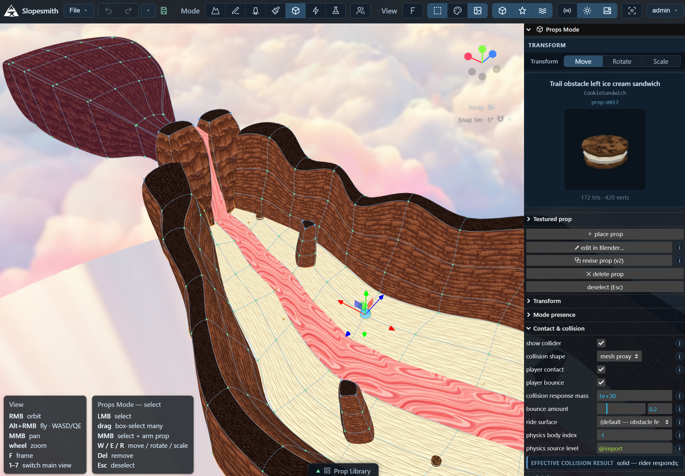
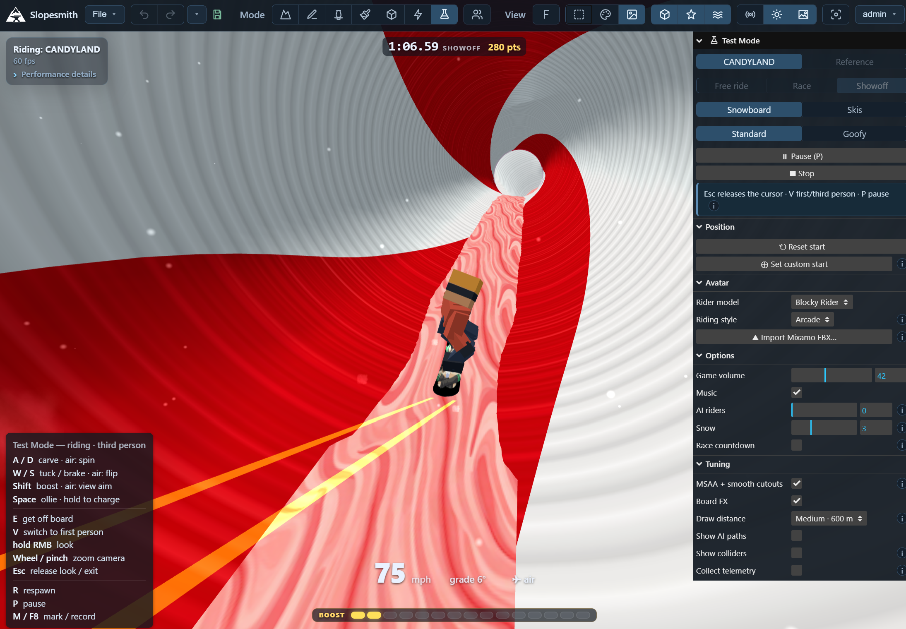

# OpenSlope

**Build and ride *SSX Tricky*-compatible maps—including entirely original courses—together, from
almost any device.**

At the center of OpenSlope is [Slopesmith](Slopesmith/README.md), a collaborative, self-hosted browser
editor and riding space. Shape a mountain together, test-ride it, and see one another live with optional
voice chat. It runs on desktop and mobile browsers and directly on a standalone Quest through WebXR—no
native client or PC streaming required.

OpenSlope also includes the interoperability tools and research needed to move courses between runtimes.
Author from scratch, or convert data locally from a user-supplied *SSX Tricky* disc image where making
and using that image is permitted by applicable law. Both routes produce the same inspectable map folder
for use in the browser, glTF and Unity workflows, or repacking for PCSX2 and PS2 hardware. The pipeline
is backward-compatible with *SSX Tricky* without limiting new courses to what the original game could do.

OpenSlope is independent and unofficial, and ships no retail game content. [`LEGAL.md`](LEGAL.md)
sets out what that means, and how to reach us if you hold rights in something you believe this
repository carries.

| Author in the browser | Test-ride without exporting |
|---|---|
|  |  |

## Create and collaborate

- **Author together.** Invite people to a private server, edit shared projects with durable revisions
  and conflict handling, and control access with roles and per-mountain permissions.
- **Build a complete course in the browser.** Shape Bézier terrain, paint ride surfaces, and place
  props, lights, rails, pickups, audio, weather, and effects without leaving Slopesmith.
- **Generate art when you need it.** Describe seamless terrain textures, transitions, decals, or a
  textured 3D prop and add it to the open mountain using your own fal.ai key. Slopesmith records model
  provenance; see [texture generation](Slopesmith/docs/033-generate-texture.md) and
  [prop generation](Slopesmith/docs/032-imported-props.md).
- **Bring your own rider.** Choose a built-in character, add a compatible GLB, or import a Mixamo FBX
  into the server-wide [custom avatar library](Slopesmith/docs/030-character-models.md#server-wide-character-library).
- **Hang out while you make and ride.** Add opt-in, self-hosted [voice chat](Slopesmith/docs/048-voice-chat.md),
  and use the shared [Jukebox](Slopesmith/docs/063-video-bridge.md) to watch a synchronized YouTube queue
  through YouTube's embedded player.

## Play on the hardware you have

- **Standalone Quest.** Open a Slopesmith site in the headset and enter WebXR. Riding, physics, and
  rendering happen locally, with tracked head and hands, seated or room-scale play, body calibration,
  flight, first/third person, and in-headset performance controls.
- **Phones and tablets.** Ride full-screen with touch controls designed for landscape play, or attach
  any standard Web Gamepad device exposed by the browser—including Backbone and MFi controllers on
  iOS—and use the same board controls as desktop.
- **Desktop and laptop.** Use keyboard and mouse or a standard game controller; no separate client is
  required.

The renderer targets constrained standalone hardware. The measured Quest 3 reference profile holds
60 fps at 1.5× render scale with anti-aliasing; the
[ride and performance guide](Slopesmith/docs/016-ride.md#performance) covers the profile, profiler,
and quality controls.

## Compatibility without being a port

OpenSlope is not a port of *SSX Tricky*. Slopesmith and the Unity runtimes are independent
reimplementations that aim to preserve the course-facing mechanics needed to ride the same terrain,
catch and grind its rails, and otherwise make compatible maps work. They do not include the original
game's characters or trick system; they use OpenSlope-specific riders and added features. One example
is Air Boost: while airborne, boost can add directed thrust and give a rider the extra edge needed to
catch a rail.

To ride a map with the original characters, tricks, and game rules, repack it using a user-supplied disc
image and play the result with PCSX2 or your own PS2 hardware. See the
[repacking guide](Snowknife/REPACK.md).

## Highlights

- **The complete round trip.** Convert a disc-backed course into an inspectable, browser-playable map,
  or repack a map exported from an entirely original Slopesmith mountain into a native game slot for
  PCSX2 or PS2.
- **A serious Bézier terrain modeler in the browser.** Stable quad topology supports sculpting, loop
  cuts, extrusion, bridges, tubes, patch drawing, cutting, ripping, dissolving, welding, and
  contour-flow retopology.
- **Interactive course content.** Rails, movers, triggers, breakables, boost and reset volumes,
  particles, fog, lighting, ambient audio, and other effects are authorable and playable in the browser
  and can flow into native repacks.
- **Riding became part of authoring.** Slopesmith can playtest authored or reference terrain, follow AI
  race lines, grind curved rails, and host shared sessions with live custom avatars.
- **Fidelity is testable.** Versioned schemas, cross-runtime effect tests, collision labs, telemetry,
  and repository-wide verification keep the browser, portable formats, and disc-backed paths honest.

## Try Slopesmith locally

For original authoring, you only need [Node.js 24](https://nodejs.org/) and this repository. No game
disc, Blender installation, or separately installed native dependency is required.

```powershell
git clone https://github.com/swax/OpenSlope.git
cd OpenSlope/Slopesmith
npm ci
npm run dev
```

Open `http://localhost:5179`. The editor starts with local, gitignored project storage; create or open
a mountain, use the mode switcher to edit it, and enter **Test** to ride. **Export map…** writes the
portable `Maps/<NAME>/` form and includes a `Repack.md` with the next commands for that export.

Slopesmith binds to your own machine by default. Its API can read and write projects and local maps,
so do not expose the development server directly to the internet.

## Run a private server

Choose the setup that matches who needs access:

| Use | Setup |
|---|---|
| Just you, on one computer | Use `npm run dev`; the editor and API stay on loopback. |
| A short-lived session on an isolated, trusted LAN | Run `npm run dev -- --host --unsafe-open-network`. Everyone who can reach it has owner-level access. |
| A persistent private server | Follow the [production deployment guide](Slopesmith/docs/041-production-deployment.md). It covers invitation-based accounts, TLS, persistent storage, service templates, backups, updates, monitoring, and optional voice chat. |

## Choose a starting point

Slopesmith is the primary runtime to start with today. The other components support conversion,
interoperability, and alternate runtimes at different maturity levels:

| I want to… | Start here | Status and requirements |
|---|---|---|
| Author, collaborate, and ride | [Slopesmith](Slopesmith/README.md) | Primary runtime; Node.js 24 and a modern browser |
| Import, inspect, convert, or repack a course | [Snowknife](Snowknife/README.md) | Maintained CLI; .NET 10, the `SSX-Library` submodule, and a user-supplied disc image for retail workflows |
| Repack an authored course for PCSX2 or PS2 | [Repacking guide](Snowknife/REPACK.md) | Maintained workflow; a user-supplied disc image |
| Understand the formats and behavior | [Trailmap](Trailmap/README.md) | Drafted specification; no game binary or assets |
| Ride a map in Unity or VRChat | [Unity](Unity/README.md) | Source integration; Unity 2022.3.22f1, plus the VRChat SDK and UdonSharp for VRChat |
| Try the Unity 6 runtime | [Basis](Unity/Basis/README.md) | Experimental runtime; matching Basis client/server checkouts |
| Inspect or remodel content in Blender | [Blender](Blender/README.md) | Exploratory tools; tested versions vary by workflow |

## How the pieces fit

```text
Slopesmith export ──────────────────────┐
user-supplied disc image ─> Snowknife ──┴─> Maps/<NAME>/ ─┬─> glTF / Unity / portable tools
                                                          └─> Snowknife repack ─> PCSX2 / PS2
```

`Maps/<NAME>/` is the shared boundary: a portable folder of geometry, textures, audio, and JSON
contracts. Slopesmith writes it directly; Snowknife imports retail data into it; the glTF builder,
Slopesmith's reference view, the Unity importer, and the ISO repacker consume it. The shared schemas live under
[`Snowknife/Snowknife/schemas/`](Snowknife/Snowknife/schemas/README.md).

In the documentation, a **course** is what someone creates and rides, a **mountain** is an editable
Slopesmith project, a **map** is the portable `Maps/<NAME>/` artifact, and a **level** is a platform's
native representation.

## Project boundaries

No retail executable, disc image, or extracted game asset ships in this repository. Disc-backed
workflows require a user-supplied image, and their generated data stays in gitignored local folders.
Users are responsible for determining whether making or using an image is permitted under applicable
law and contractual terms. Do not distribute builds containing retail-derived content.

Authored courses made from material you created or may redistribute can be shared independently of
private disc-backed data. Trailmap keeps behavioral specifications separate from their research
provenance, and each component's `NOTICE` describes its scope and third-party attributions.
[`LEGAL.md`](LEGAL.md) states the full scope and the trademark position.

## Documentation and contributing

See [CONTRIBUTING.md](CONTRIBUTING.md) for project scope, faster component checks, test tiers,
environment setup, reverse-engineering hygiene, coding conventions, and pull-request expectations.
The full repository gate is `npm run verify` after installing the prerequisites listed there. Useful
indexes and background include:

- [Slopesmith authoring and design docs](Slopesmith/docs/README.md)
- [Snowknife extraction and bundle docs](Snowknife/docs/README.md)
- [Trailmap specifications](Trailmap/specs/README.md)
- [Development history](DEVELOPMENT_HISTORY.md)

The repository is designed to work well with Codex and Claude Code: its documentation describes
subsystem ownership, portable contracts, behavior, deployment, and tests. Slopesmith also has a
development-only [agent layer](Slopesmith/docs/029-agent-layer.md) for inspecting and driving the WebGL
editor. Review AI-assisted changes and run the relevant repository checks.

## Credits

OpenSlope builds on years of work by the SSX modding and preservation community, especially:

- [SSX-Library](https://github.com/GlitcherOG/SSX-Library) — GlitcherOG, Erickson Munoz, and Jaime Solsona.
  Snowknife builds against [a fork](https://github.com/swax/SSX-Library) that carries decoding fixes not
  yet upstream; its README lists them.
- [SSX Collection Multitool](https://github.com/GlitcherOG/SSX-Collection-Multitool),
  [SSX PS2 Collection Modder](https://github.com/GlitcherOG/SSX-PS2-Collection-Modder),
  [IceSaw](https://github.com/GlitcherOG/Icesaw-SSX-Level-Editor-Plugin), and
  [Ltg-Regenerator](https://github.com/SSXModding/Ltg-Regenerator) — GlitcherOG and Lachlan Kalf.
- [bxtools](https://github.com/Linkz64/bxtools) — Linkz64.
- [SSXTools](https://github.com/SSXModding/SSXTools),
  [bigfile](https://github.com/SSXModding/bigfile), and
  [SSX-ElfLdr](https://github.com/SSXModding/SSX-ElfLdr) — modeco80 (Lily).
- [SSXTrickyModelExporter](https://github.com/Erickson400/SSXTrickyModelExporter) — Erickson Munoz.
- [SaccFlightAndVehicles](https://github.com/Sacchan-VRC/SaccFlightAndVehicles) — Sacchan-VRC.

Claude Code and Codex assisted development under human direction, review, testing, and play-testing.
Corrections to these credits are welcome.

## License

The repository is not licensed as one unit. [`LICENSE`](LICENSE) maps every component to its license:
Snowknife is GPL-3.0-only, its portable schemas are Apache-2.0, other repository-authored components
are Apache-2.0, and the `SSX-Library` submodule retains its upstream license. See each component's
`NOTICE` for its detailed scope and third-party attributions.

SSX and SSX Tricky are trademarks of Electronic Arts Inc. Rights in the music and voice performances
on a retail disc are held by their publishers, labels, and performers and are licensed to Electronic
Arts; no grant here extends to them.

**Rightsholder enquiries: contact@transparentsource.org.** If you hold rights in something you believe this
repository carries, write to that address and we will act on a specific, good-faith request about
specific material. [`LEGAL.md`](LEGAL.md) has the full statement. Security reports go elsewhere — see
[SECURITY.md](SECURITY.md).
